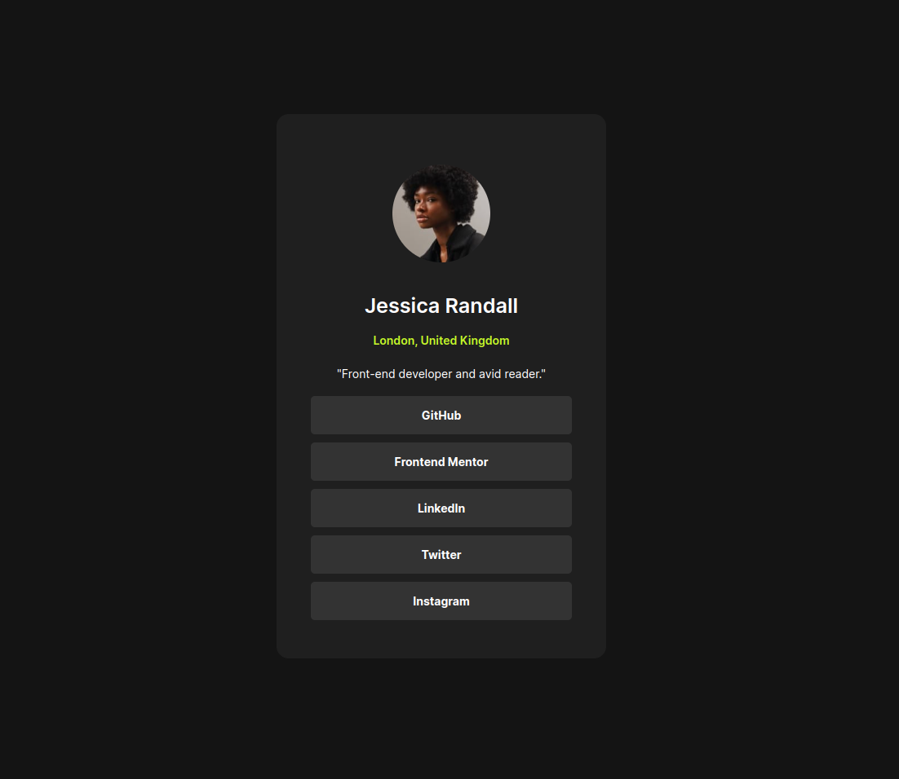

# Frontend Mentor - Social links profile solution

This is a solution to the [Social links profile challenge on Frontend Mentor](https://www.frontendmentor.io/challenges/social-links-profile-UG32l9m6dQ). Frontend Mentor challenges help you improve your coding skills by building realistic projects. 

## Overview

### The challenge

Users should be able to:

- See hover and focus states for all interactive elements on the page

### Screenshot

### Links

- Solution URL: [gitHub repo](https://github.com/yousifpa98/FrontendMentor-Social_links_profile_solution)
- Live Site URL: [gh pages](https://yousifpa98.github.io/FrontendMentor-Social_links_profile_solution/)

### Built with

- Semantic HTML5 markup
- CSS custom properties
- Flexbox

## Author

- Website - [Yousif Paulus](https://www.yousifpaulus.dev)
- Frontend Mentor - [@yourusername](https://www.frontendmentor.io/profile/yousifpa98)
- GitHub - [@yousifpa98](https://github.com/yousifpa98)